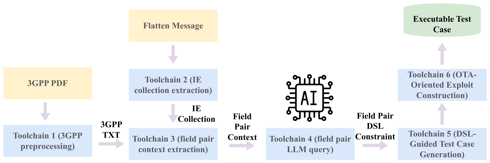
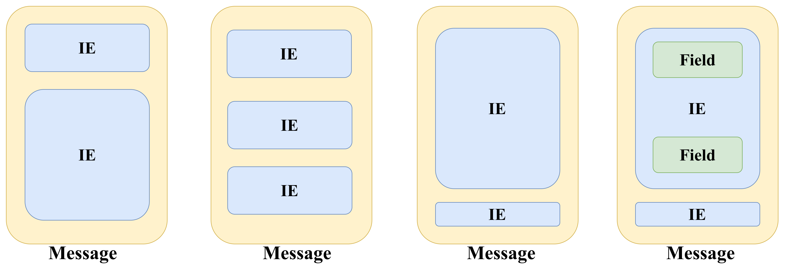

# Overview

This repository provides the complete artifact for evaluating **CONSET**, the
constraint-guided semantic testing framework presented in the paper
*“Semantics Over Syntax: Uncovering Pre-Authentication 5G Baseband Vulnerabilities.”*

The artifact is organized into three logical components that together enable
end-to-end validation of the paper’s methodology and key claims:

- **A1 — Simulation Testbed:**  
  A simulation-based 5G SA testing environment built on OAI and 5Ghoul, used to
  inject crafted RRC messages and observe UE behavior in a controlled setting.

- **A2 — Constraint-Driven Toolchain:**  
  A modular analysis and test-generation pipeline that extracts
  specification-level semantic constraints and translates them into executable
  test cases.

- **A3 — Test Cases and Exploits:**  
  Generated test cases and proof-of-concept exploit payloads that trigger
  reproducible UE crashes in the simulation environment.

# Execution Model (IMPORTANT)

CONSET’s artifact follows a two-stage workflow:

- **E1 — A2 (Constraint / Payload Generation)**  
  Runs on the **host OS environment** (Ubuntu 22.04 + Python 3.10).  

- **E2 — A1/A3 (Exploit Replay / Crash Reproduction)**  
  Runs in the **simulation execution environment**, which can be accessed in either of the following ways:
  1) **Local Docker** (recommended for local evaluation): run the provided Docker image on your own machine.  
  2) **Optional remote desktop** (recommended for convenience): use our pre-configured remote desktop where the same Docker-based simulation environment is already set up and ready to run.  
     **Remote access details are provided privately via the HotCRP Artifact Evaluation interface.**

In short: **E1 (A2) runs on the host**, while **E2 (A1/A3) run inside the Docker-based simulation environment** (either locally via Docker, or via the remote desktop that already has Docker running).

---

# Mapping Between Paper Experiments and Artifact Components

| Paper Experiment | Artifact Component | Execution Environment |
|:---|:---|:---|
| **E1** — Constraint extraction & semantic test generation | **A2** (Constraint-Driven Toolchain) | **Host** (Ubuntu 22.04 + Python 3.10) |
| **E2** — Crash reproduction in OAI UE | **A1** (Simulation Testbed) + **A3** (Exploit Replay) | **Docker container** (or remote desktop) |

> **Key points:**
> - **E1 → A2**: Runs on the **host environment only**. Does **NOT** require Docker.
> - **E2 → A1 + A3**: Runs inside the **Docker container only**. Does **NOT** require running A2.

---

All experiments are conducted **exclusively in an isolated simulation
environment**. The artifact does **not** include over-the-air (OTA) exploits for
commercial networks or devices.

For evaluator convenience, the artifact supports two execution modes:
local execution using Docker, and an optional pre-configured remote desktop
environment provided via the HotCRP Artifact Evaluation interface.

---

# E1 / E2 — Execution Commands and Steps

## E1: Constraint Extraction & Semantic Test Generation

**E1 corresponds to A2 (Constraint-Driven Toolchain).** All commands run on the **host environment** (not Docker).

All step-by-step instructions can be found at **either** of the following locations (both contain the **same content**):

- Main README: https://github.com/qiqingh/contest_AE_final/tree/main?tab=readme-ov-file#a2--constraint-driven-toolchain-conset
- A2 detailed README: https://github.com/qiqingh/contest_AE_final/blob/main/A2_constraintdriven_toolchain/A2_README.md#a2--constraint-driven-toolchain-conset

---

## E2: Crash Reproduction in OAI UE

**E2 corresponds to A1 (Simulation Testbed) + A3 (Exploit Replay).** All commands run inside the **Docker container** (or remote desktop).

All step-by-step instructions can be found at:

- A1 — Simulation Testbed: https://github.com/qiqingh/contest_AE_final/tree/main?tab=readme-ov-file#a1-simulation-testbed
- A3 — Test Cases & Proof-of-Concept Exploits: https://github.com/qiqingh/contest_AE_final/tree/main?tab=readme-ov-file#a3-test-cases-and-proof-of-concept-exploits

---
# E1 / E2 — Expected Results and What to Check

## E1: What to Observe

**Step 1: Valid Semantic Rules Were Extracted**

Reviewers can search for the keyword `"has_valid_rule": true` in the following directories:

- **Intra-IE DSL results:**
  ```
  contest_AE_final/A2_constraintdriven_toolchain/toolchain4_field_pair_LLM_query/intra-IE/outputs/intra-IE_DSL_results_gpt4o
  ```
- **Inter-IE DSL results:**
  ```
  contest_AE_final/A2_constraintdriven_toolchain/toolchain4_field_pair_LLM_query/inter-IE/output/inter_ie_dsl_rules_gpt4o
  ```
  
In the provided artifact snapshot, this yields **66** (intra-IE) and **151** (inter-IE) entries. (Counts may vary if you re-run optional regeneration steps.)

**Step 2: Each Valid DSL Rule Encodes a Semantic Constraint**

Reviewers may inspect a few DSL rule files and confirm they contain:

- Rules explicitly reference **field-level dependencies**
- Rules express **constraint relations** 

**Step 3: DSL Rules Are Translated into Structured OTA-Style Payloads**

The generated payloads can be found at:

- **Intra-IE payloads:**
  ```
  contest_AE_final/A2_constraintdriven_toolchain/toolchain6_generate_OTA_testcase/intra-IE/output/06_payloads
  ```
- **Inter-IE payloads:**
  ```
  contest_AE_final/A2_constraintdriven_toolchain/toolchain6_generate_OTA_testcase/inter-IE/output/06_payloads
  ```

Reviewers should verify that:

- The payload contains **deterministic offset-based modifications**

---

## E2: What to Observe

All E2 commands run **inside the Docker container**:

```bash
sudo docker exec -it CONTAINER_ID /bin/bash
cd /home/5ghoul-5g-nr-attacks
```

**Step 1: Baseline Run (Without Exploit) — UE Should NOT Crash**

Run the simulator **without** loading any exploit:

```bash
sudo bin/5g_fuzzer --EnableSimulator=true --EnableMutation=false --GlobalTimeout=false
```

You should observe the UE repeatedly starting and stopping **without crashing**, e.g.:

```
[UE] Found RAR. Connection Timeout: 1000 MS
--------------------------------------------------------
[Optimizer] Iter=1  Params=[0.2,0.2,0.2,0.2,0.2,0.2,...,0.2]
[Optimizer] Fitness=2  Adj. Fitness=-2
--------------------------------------------------------
[UE] Restarting connection...
[!] UE process stopped
[!] UE process started
[UE] Found RAR. Connection Timeout: 1000 MS
--------------------------------------------------------
[Optimizer] Iter=2  Params=[0.2,0.2,0.2,0.2,0.2,0.2,...,0.2]
[Optimizer] Fitness=10  Adj. Fitness=-10
--------------------------------------------------------
[UE] Restarting connection...
[!] UE process stopped
[!] UE process started
```

> **Note:** Expected log pattern is repeated [!] UE process stopped / [!] UE process started cycles. Occasional crashes may still occur due to simulator instability.

**Step 2: Exploit Run (With Exploit Loaded) — UE Should Crash Frequently**

Run the simulator **with** an exploit loaded, e.g.:

```bash
sudo ./bin/5g_fuzzer \
  --exploit=mac_sch_6e99a9e9 \
  --MCC=001 \
  --MNC=01 \
  --GlobalTimeout=false \
  --EnableMutation=false
```

The simulator should **frequently** report:

```
[!] UE process crashed
```

**What this demonstrates:** Enabling the provided exploit payloads leads to **frequent UE crashes** in the simulation environment, compared to the baseline run.

---


The sections below describe how to set up, execute, and validate each component
(A1–A3).

Alternatively, detailed instructions can also be found in the corresponding **A1** and **A3** folders within the repository.

# For E1 Experiment (A2)

# A2 – Constraint-Driven Toolchain (CONSET)

This directory contains the complete **A2 constraint-driven toolchain** used in the paper to:
1) preprocess 3GPP specifications (optional),
2) extract IEs set to cover the 5G messgae,
3) extract field pairs related context from 3GPP specifications
4) query an LLM to synthesize DSL rules (optionally) ,
5) generate DSL-guided semantic test cases,
6) produce replayable (OTA-style) payloads (for simulation usage).

> **Important note (Phase-2 AE):**
> - The **LLM-dependent steps are OPTIONAL** and **not required** for functional/reproducible assessment.
> - Reviewers can run the required steps using the **pre-generated intermediate artifacts** provided in this repository (e.g., extracted contexts, field pairs, DSL rules, and/or generated testcases).

---

## Environment Setup

The following steps have been verified on a Ubuntu 22.04 environment.

### Step 1: Start a clean Ubuntu 22.04 environment
```bash
docker run -it --name ae_e1_test ubuntu:22.04 bash
```

### Step 2: Install system dependencies
```bash
apt update && apt install -y git python3 python3-venv python3-pip python3-dev \
  gcc g++ build-essential make cmake pkg-config \
  libcairo2-dev libsystemd-dev gettext libdbus-glib-1-dev \
  libgirepository1.0-dev libdbus-1-dev libcups2-dev
```

### Step 3: Clone the repository
```bash
git clone https://github.com/qiqingh/contest_AE_final
cd contest_AE_final/A2_constraintdriven_toolchain
```

### Step 4: Set up Python virtual environment and install dependencies
```bash
python3 -m venv .venv
source .venv/bin/activate
pip3 install -r installed_packages.txt
```

### Step 5: Verify installation
```bash
python3 -c "from pycrate_asn1dir import RRCNR; print('pycrate OK')"
```

## Toolchain Overview (T1–T6)



The A2 pipeline is organized into six toolchains.
Recommended Phase-2 path: run T2 → T3 → T5 → T6 (no external keys required).

The A2 toolchain is split into six independent stages, each with a distinct purpose. This separation allows individual stages to be run, replaced, or reused independently — for example, skipping T1/T4 using pre-generated intermediates, or reusing T3 outputs for different LLM backends in T4.

| Toolchain | Input | Output | Required |
|:---|:---|:---|:---|
| **T1 – 3GPP Preprocessing** | 3GPP spec PDFs | LaTeX-structured 3GPP text (.txt) | Optional (Mathpix key) |
| **T2 – IE Collection** | Flattened 5G message | Representative IE sets (intra-IE and inter-IE) | Required |
| **T3 – Field-Pair Context Extraction** | IE sets (from T2) & 3GPP text (from T1) | Per-field-pair relevant 3GPP text snippets | Required |
| **T4 – LLM-Based DSL Constraint Synthesis** | Field-pair context snippets (from T3) | DSL constraint rules with supporting evidence | Optional (OpenAI key) |
| **T5 – Test Case Generation** | DSL constraint rules (from T4 or pre-generated) | Constraint-violating field modifications | Required |
| **T6 – OTA Payload Generation** | Test cases (from T5) | Byte-level exploit payloads (offset + value) | Required |



**Note:** A 5G RRC message is composed of multiple **Information Elements (IEs)**, and each IE contains multiple **fields**. Since 5G RRC messages contain deeply nested IEs, our goal is to extract semantic constraints between fields. T2 identifies a minimum-cost set of IEs that covers the full message structure. 

To capture both types of field relationships, we split the analysis into two tracks: **intra-IE** (constraints between fields within the same IE) and **inter-IE** (constraints between fields across different IEs).

> **Note:** All subsequent toolchain commands assume you are already inside `contest_AE_final/A2_constraintdriven_toolchain/`. Use relative paths from there, e.g. `cd toolchain1_3GPP_preprocessing/code`.
> 
## T1 – 3GPP Preprocessing (OPTIONAL)

This step converts specification PDFs into parseable text/snippets.
**Requires a Mathpix API key**. If you do not have a key, you may skip T1 and use the preprocessed outputs provided in this repo.

```
cd toolchain1_3GPP_preprocessing/code
python3 mathpix_processor.py
cd -
```

### Inputs: 
3GPP spec PDFs (see contest_AE_final/A2_constraintdriven_toolchain/toolchain1_3GPP_preprocessing/pdf_specifications)

### Expected outputs:

- Parsed 3GPP specification text files saved to:
```
  toolchain1_3GPP_preprocessing/outputs/txt_specifications_mathpix
```

## T2 – IE Collection (REQUIRED for full regeneration)

This step identifies candidate IEs and selects representative sets.

###  T2 (intra-IE)

```
cd toolchain2_IE_collection/intra-IE/code
python3 00_extract_IE_id.py
python3 01_filter_IE_with_ASN.py
python3 02_greedy_set_cover_intra.py
cd -
```
> **Note:** When prompted, you may select option `1 - 1st Place (Recommended)`.

### T2 (inter-IE)

```
cd toolchain2_IE_collection/inter-IE/code
python3 00_extract_IE_id.py
python3 01_filter_IE_with_ASN.py
python3 02_greedy_set_cover_inter.py
cd -
```
> **Note:** When prompted, you may select option `1 - 1st Place (Recommended)`.


### Expected outputs:

- **Intra-IE:** final selected IE set saved to:
```
  toolchain2_IE_collection/intra-IE/outputs/intra-IE_strategy/selected_ies
```
- **Inter-IE:** final selected IE set saved to:
```
  toolchain2_IE_collection/inter-IE/outputs/inter-IE_strategy/selected_ies
```

> If you only want to validate later stages, you may use the repository's pre-generated IE lists in the above directories.


## T3 – Field-Pair Context Extraction (REQUIRED for full regeneration)

This step extracts **evidence contexts** for candidate field pairs.

### T3 (intra-IE)

```
cd toolchain3_field_pair_context_extraction/intra-IE/code
python3 00_intra-IE_context_extract.py --all-pairs --no-self
cd -
```

### T3 (inter-IE)

```
cd toolchain3_field_pair_context_extraction/inter-IE/code
python3 00_generate_aggressive_inter_ie_config.py
python3 01_inter_ie_enhanced_extractor.py
cd -
```


### Expected outputs:

- **Intra-IE:** extracted field-pair context snippets saved to:
```
  toolchain3_field_pair_context_extraction/intra-IE/outputs/context_with_sections_all_pairs
```
- **Inter-IE:** extracted field-pair context snippets saved to:
```
  toolchain3_field_pair_context_extraction/inter-IE/output/context_enhanced
```
  

## T4 – LLM-Based DSL Synthesis (OPTIONAL)

This step turns extracted evidence into DSL rules using an LLM.
**Requires an OpenAI API key**. For Phase-2 evaluation, this is **not required** because **pre-generated DSL rules** are included.

To run anyway, set your API key in your environment:

export OPENAI_API_KEY="YOUR_KEY"

### T4 (intra-IE)

```
cd toolchain4_field_pair_LLM_query/intra-IE/code
python3 00_aggregate_intra_ie_constraints.py
python3 01_generate_intra_ie_dsl.py
cd -
```

### T4 (inter-IE)

```
cd toolchain4_field_pair_LLM_query/inter-IE/code
python3 00_aggregate_inter_ie_field_pairs.py
python3 01_generate_inter_ie_dsl_concurrent.py
cd -
```

### Expected outputs:

- **Intra-IE:** DSL constraint rule files saved to:
```
  toolchain4_field_pair_LLM_query/intra-IE/outputs/intra-IE_DSL_results_gpt4o
```
- **Inter-IE:** DSL constraint rule files saved to:
```
  toolchain4_field_pair_LLM_query/inter-IE/output/inter_ie_dsl_rules_gpt4o
```

## T5 – DSL → Testcase Generation (REQUIRED)

This step converts DSL rules into structured test case specifications.

```
cd toolchain5_dsl_to_testcase/code
python3 unified_test_generator.py
cd -
```

### Inputs: 
DSL rules (either from T4 or pre-generated)

### Expected outputs:

- **Intra-IE:** generated constraint-violating field modifications saved to:
```
  toolchain5_dsl_to_testcase/output/test_cases_intra_ie
```
- **Inter-IE:** generated constraint-violating field modifications saved to:
```
  toolchain5_dsl_to_testcase/output/test_cases_inter_ie
```


## T6 – OTA-Style Testcase Payload Generation (REQUIRED for A3 replay inputs)

This step reconstructs messages, re-encodes them, computes offsets, and emits payload files.

### T6 (intra-IE)

```
cd toolchain6_generate_OTA_testcase/intra-IE/code
python3 ./run_T6.py
cd -
```

### T6 (inter-IE)

```
cd toolchain6_generate_OTA_testcase/inter-IE/code
python3 ./run_T6.py
cd -
```

### Expected outputs:

- **Intra-IE:** replayable payload files saved to:
```
  toolchain6_generate_OTA_testcase/intra-IE/output/06_payloads
```
- **Inter-IE:** replayable payload files saved to:
```
  toolchain6_generate_OTA_testcase/inter-IE/output/06_payloads
```

> **Note:** T6 decodes the original message, applies constraint-violating modifications, and re-encodes it. Intermediate outputs from each step are retained in the output directory to facilitate diagnosis after the message decode and then modify and later re-encode pipeline. Each stage's output can also be used independently for other purposes, such as custom payload construction or integration with other testing frameworks.

## Suggested Minimal Path for Phase-2 AE

If you want a straightforward Phase-2 run without any external API keys:

1. **Environment Setup**
2. **Use provided pre-generated outputs** for T2/T3/T4
3. **Run:**
   - **T5**: `unified_test_generator.py`
   - **T6**: the intra-IE or inter-IE payload pipeline above

This validates that the toolchain executes end-to-end and produces payloads.

## Troubleshooting Notes

- **If `pycrate_asn1dir` import fails:**
  - Ensure that `pip3 install -r installed_packages.txt` was executed in the correct Python environment (e.g., the activated virtual environment).
  - Confirm that you are using **Python 3.10.x**.

- **If some scripts expect large input files** (e.g., specification excerpts or cached intermediate data):
  - Use the **pre-generated intermediate artifacts** committed in this repository (recommended for Phase-2 evaluation).

- **If you choose to run optional toolchains (T1 / T4):**
  - **T1** requires a valid **Mathpix API key**.
  - **T4** requires a valid **OpenAI API key**.
  - These steps are **optional** and **not required** to validate the functionality or reproducibility of the artifact.

## Security / Safety

This A2 toolchain **only generates testcases and payloads intended for use in the provided simulation environment**.
OTA exploits targeting commercial devices are not included.


# For E2 Experiment (A1 & A3)

# A1: Simulation Testbed

The A1 component provides a simulation-based 5G SA testbed built on an
instrumented OAI gNB. To simplify evaluation, we provide a pre-built
Docker image as well as optional remote desktop access.

### Option 1: Docker-based setup (recommended)

This is the easiest and recommended way to run A1 and A3.

#### Step 1: Pull the pre-built Docker image

```
sudo docker pull kqing0515/oai_testing:v3
```
#### Step 2: Launch the container

```
sudo docker run -it \
  --name oai25_testing \
  --cpus="8" \
  --privileged \
  --ipc=host \
  --network=host \
  --mount type=tmpfs,destination=/dev/shm \
  --mount type=tmpfs,destination=/dev/mqueue \
  kqing0515/oai_testing:v3
```

After the container starts, the OAI-based simulation environment and all
required dependencies for A1/A3 are available inside the container.

This setup runs entirely in a local simulation environment and does
not require any real 5G radio hardware.

### Option 2: Optional remote desktop access

For reviewer convenience, we also provide access to a pre-configured
remote desktop environment where the Docker-based A1/A3 setup is already
installed and ready to run.
- This option avoids any local installation.
- **Remote access details (including the access link) are provided
privately via the HotCRP Artifact Evaluation interface.**
- The remote environment is intended only for artifact evaluation.


# A3: Test Cases and Proof-of-Concept Exploits

This directory contains the generated test cases and proof-of-concept
exploit payloads used to validate the vulnerability-triggering behavior
described in the paper. All A3 experiments are conducted **only in a
simulation environment** based on OAI and 5Ghoul.

**Important:**  
All provided exploits are **simulation-only** and are **not usable
over-the-air (OTA)**.

---

## Prerequisites

- Docker is installed and running
- The A1 simulation environment is launched using the provided Docker image: kqing0515/oai_testing:v3
- Reviewers may either:
- Run everything locally using Docker, **or**
- Use the **pre-configured remote desktop environment** provided via HotCRP
  (recommended, as the container and payloads are already set up)

---

## Step 1: Copy Payloads into the Docker Container

After the Docker container is running, copy the prepared payloads into
the container.

On the host machine:

```
sudo docker ps
```
Identify the running container ID (CONTAINER_ID), then run:

```
sudo docker cp contest_AE_final/A3_test_case_exploits/payloads \
CONTAINER_ID:/home/5ghoul-5g-nr-attacks/modules/exploits/5gnr_gnb
```

## Note:
If you are using the provided remote desktop environment, this step can
be skipped—the payloads have already been placed in the correct location.

## Step 2: Enter the Docker Container

```
sudo docker exec -it CONTAINER_ID /bin/bash
```

Inside the container:

```
cd /home/5ghoul-5g-nr-attacks/modules/exploits/5gnr_gnb
cp ./payloads/* ./
cd /home/5ghoul-5g-nr-attacks
```

## Step 3: Recompile Exploits

Recompile all exploit payloads using:

```
sudo bin/5g_fuzzer --list-exploits
```

## Note:

Some compilation warnings or errors may appear during this step.
These can be safely ignored as long as the target exploit is successfully
registered.

## Step 4: Run a Specific Exploit Payload

The available exploit names can be found in:
```
contest_AE_final/A3_test_case_exploits/compiled_payloads/
```

To run a specific exploit:

```
sudo ./bin/5g_fuzzer \
  --exploit=PAYLOAD_NAME \
  --MCC=001 \
  --MNC=01 \
  --GlobalTimeout=false \
  --EnableMutation=false
```

### Example

If the exploit file is:

```
mac_sch_6e99a9e9.cpp
```
Run:
```
sudo ./bin/5g_fuzzer \
  --exploit=mac_sch_6e99a9e9 \
  --MCC=001 \
  --MNC=01 \
  --GlobalTimeout=false \
  --EnableMutation=false
```

## Expected Behavior (With Exploit)

When running a valid exploit payload, the simulator should frequently
report:

```
[!] UE process crashed
```

This indicates successful triggering of the vulnerability in the simulated UE.

## Baseline Behavior (Without Exploit)

As a control experiment, run the simulator **without loading any exploit**:
```
sudo bin/5g_fuzzer \
  --EnableSimulator=true \
  --EnableMutation=false \
  --GlobalTimeout=false
```

Expected output in this case is typically:

```
[!] UE process stopped
[!] UE process started
```

Crashes ([!] UE process crashed) should occur **rarely**, although some instability in the simulator is known and expected.

## Notes

- All crashes observed in A3 are **simulation-only** and occur in a
controlled laboratory environment.
- These experiments are intended to validate the **exploitability and
reproducibility** of the generated test cases, not to demonstrate real-world OTA attacks.
